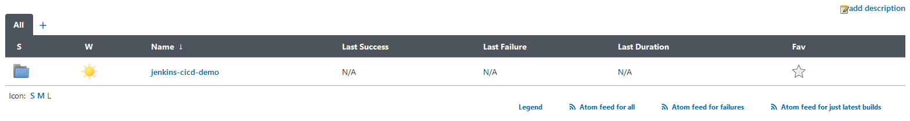
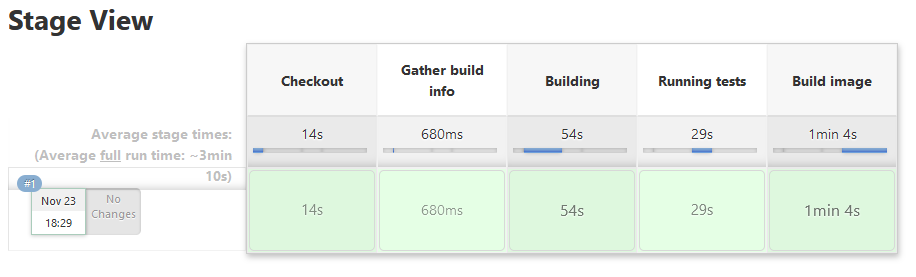
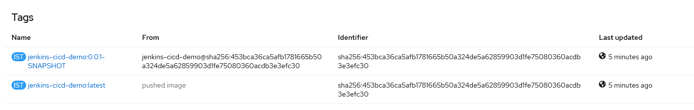

# Jenkins Pipelines Workshop

## Workshop to Demostrate Jenkins Pipelines in Openshift

## Description

This workshop will guide you through the installation of a Jenkins in Openshift and the configuration and use of Jenkins Pipelines in Openshift.

## Workshop Overview

The following list shows the seven steps that will be used to get our CI/CD pipeline up and running:

* Create the CICD Workshop Project
* Install Jenkins Ephemeral
* Create Build Pipeline
* Execute Build Pipeline
* Create Deployment Pipeline 
* Execute Deployment Pipeline
* Validate Application Deployment

## Create the CICD Workshop Project

Create an OpenShift project in which the workshop resources will be created:

```
oc new-project jenkins-cicd-demo
```

## Install Jenkins Ephemeral

For demo purposes the Jenkins server that is going to be used is configured with **ephemeral storage**, any data stored will be lost upon pod destruction.

Install the Jenkins template provided in the workshop ocp resources folder:

```
oc process -f ocp/jenkins-ephemeral.yaml -p JENKINS_SERVICE_NAME=jenkins | oc apply -f - -n jenkins-cicd-demo
```

Example:

```
$ oc process -f ocp/jenkins-ephemeral.yaml -p JENKINS_SERVICE_NAME=jenkins | oc apply -f - -n jenkins-cicd-demo
route.route.openshift.io/jenkins created
configmap/jenkins-trusted-ca-bundle created
deploymentconfig.apps.openshift.io/jenkins created
serviceaccount/jenkins created
rolebinding.authorization.openshift.io/jenkins_edit created
service/jenkins-jnlp created
service/jenkins created
```

Wait until the Jenkins pod is ready:

```
$ oc get pods -n jenkins-cicd-demo
NAME               READY   STATUS      RESTARTS   AGE
jenkins-1-deploy   0/1     Completed   0          2m28s
jenkins-1-x9kx7    1/1     Running     0          2m25s
```

Obtain the jenkins server url from the route created by the Jenkins ephemeral template:

```
oc get route jenkins -o jsonpath='{.spec.host}' -n jenkins-cicd-demo
```

Validate that the Jenkins web UI is running by accesing the obtained url. Jenkins is integrated with the Openshift OAUTH so it will ask for the user credentials:


Once the user and password is introduced you will have access to a working Jenkins instance:


## Create Build Pipeline

The first step in the CICD process is to build the application image using a Jenkins pipeline.

Create the Openshift build pipeline:

```
oc create -f ocp/build-config-jenkins-ci-demo.yaml -n jenkins-cicd-demo
```

Example:

```
$ oc create -f ocp/build-config-jenkins-ci-demo.yaml -n jenkins-cicd-demo
buildconfig.build.openshift.io/jenkins-cicd-demo-ci-build created
```

Check that the Openshift Build Configuration is created:

```
$ oc get bc -n jenkins-cicd-demo
NAME                         TYPE              FROM       LATEST
jenkins-cicd-demo-ci-build   JenkinsPipeline   Git@main   0
```

Openshift Build Configurations of type **JenkinsPipeline** will be synchronized with the running Jenkins in the project and a new Jenkins job will be created automatically.

Check that a new Jenkins folder is created:



And that a new Jenkins Job is created:


## Execute Build Pipeline

It is posible to start the build from the command line:

```
oc start-build jenkins-cicd-demo-ci-build -n jenkins-cicd-demo
```

Example:

```
$ oc start-build jenkins-cicd-demo-ci-build -n jenkins-cicd-demo
build.build.openshift.io/jenkins-cicd-demo-ci-build-1 started
```

The Openshift Builds Section will show the stages of the Jenkins build and its status:


It is also possible to check the build status in the Jenkins dashboard:


Wait until the Jenkins job is finished:



The purpose of the job is to build an application image, validate that the image is built by checking the image streams present on the Openshift project:


Validate that the image streams tags are correct:



## Create Deployment Pipeline 

Once the application image is built, it is necessary to create a deployment pipeline that deploys the application's image to the Openshift cluster.

First of all, create the Openshift deployment pipeline:

```
oc create -f ocp/build-config-jenkins-cd-demo.yaml -n jenkins-cicd-demo
```

Example:

```
$ oc create -f ocp/build-config-jenkins-cd-demo.yaml -n jenkins-cicd-demo
buildconfig.build.openshift.io/jenkins-cicd-demo-cd-build created
```

Check that the Openshift Build Configuration is created:

```
$ oc get bc -n jenkins-cicd-demo
NAME                         TYPE              FROM       LATEST
jenkins-cicd-demo            Source            Binary     1
jenkins-cicd-demo-cd-build   JenkinsPipeline   Git@main   0
jenkins-cicd-demo-ci-build   JenkinsPipeline   Git@main   1
```

Validate that a new Jenkins job is configured in the Jenkins dashboard:


## Execute Deployment Pipeline

The deployment pipeline requires some parameters to be executed, it is possible to specify the parameters in the Jenkins dashboard:


It is also possible to execute the build from the command line:

```
$ oc start-build jenkins-cicd-demo-cd-build -e IMAGE_NAME=jenkins-cicd-demo -e IMAGE_NAMESPACE=jenkins-cicd-demo -e IMAGE_VERSION=0.0.1-SNAPSHOT -n jenkins-cicd-demo
build.build.openshift.io/jenkins-cicd-demo-cd-build-1 started
```

The deployment pipeline will deploy the resources specified in the [deployment-template.yaml](ocp/deployment-template.yaml) file and validate that the deployment is successful by checking the status of the Openshfit deployment:


The deployment template contains:

* DeploymentConfiguration
* Service
* Route

Validate that the application resources are created correctly, validate that the required resources exist and that the pod is in **Running** status:

```
$ oc get all -l app=jenkins-cicd-demo -n jenkins-cicd-demo
NAME                            READY   STATUS    RESTARTS   AGE
pod/jenkins-cicd-demo-1-g6bpg   1/1     Running   0          5m35s

NAME                                        DESIRED   CURRENT   READY   AGE
replicationcontroller/jenkins-cicd-demo-1   1         1         1       5m38s

NAME                        TYPE        CLUSTER-IP      EXTERNAL-IP   PORT(S)    AGE
service/jenkins-cicd-demo   ClusterIP   172.30.147.14   <none>        8080/TCP   5m39s

NAME                                                   REVISION   DESIRED   CURRENT   TRIGGERED BY
deploymentconfig.apps.openshift.io/jenkins-cicd-demo   1          1         1

NAME                                         HOST/PORT                                                                              PATH   SERVICES            PORT       TERMINATION   WILDCARD
route.route.openshift.io/jenkins-cicd-demo   jenkins-cicd-demo-jenkins-cicd-demo.apps.cluster-6c7bm.6c7bm.sandbox1825.opentlc.com          jenkins-cicd-demo   8080-tcp   edge          None
```

## Validate Application Deployment

Finally, validate that the application is up and running correctly.

Obtain the application route endpoint:

```
$ oc get route jenkins-cicd-demo -o jsonpath='{.spec.host}' -n jenkins-cicd-demo
jenkins-cicd-demo-jenkins-cicd-demo.apps.cluster-6c7bm.6c7bm.sandbox1825.opentlc.com
```

Execute the application `/hello-world` endpoint to validate the application status:

```
$ curl https://$(oc get route jenkins-cicd-demo -o jsonpath='{.spec.host}' -n jenkins-cicd-demo)/hello-world
  % Total    % Received % Xferd  Average Speed   Time    Time     Time  Current
                                 Dload  Upload   Total   Spent    Left  Speed
100    12  100    12    0     0     23      0 --:--:-- --:--:-- --:--:--    23Hello World!`
```


